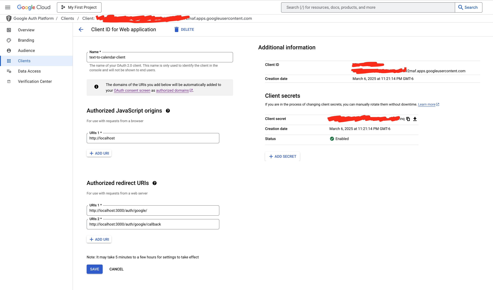
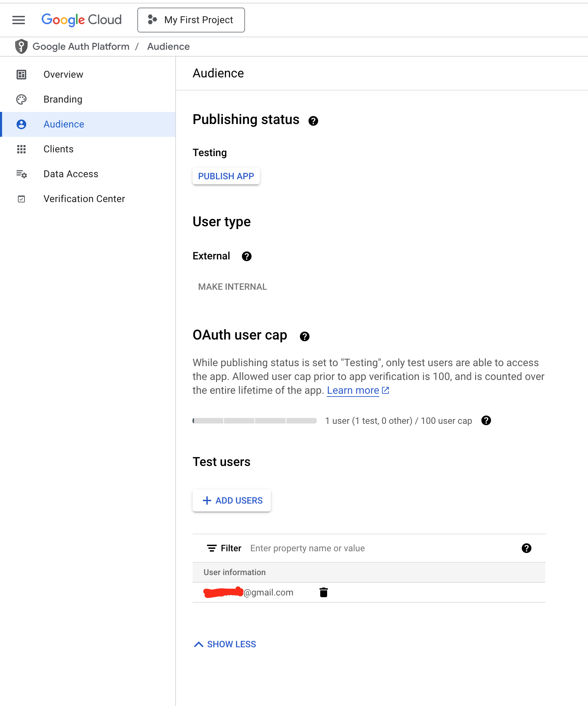
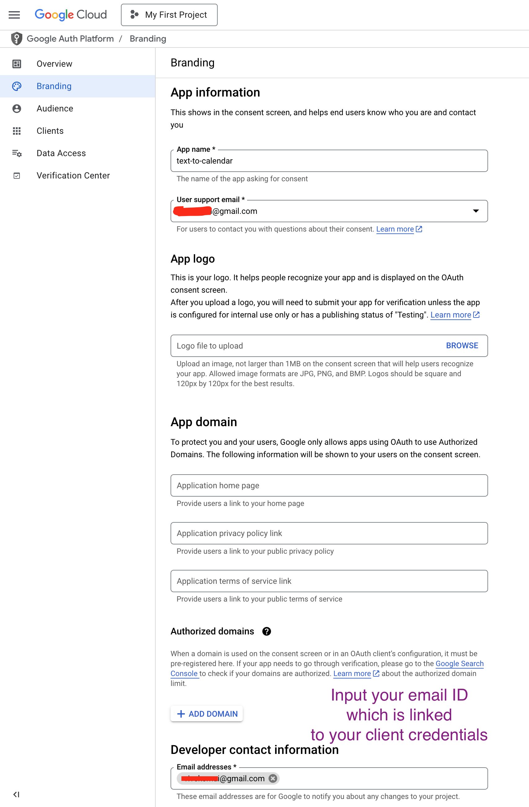

# Google OAuth Setup and Troubleshooting

This document provides steps to configure Google OAuth for the text-to-calendar application, along with common errors and solutions.

## Setup Steps

1. **Create OAuth Credentials**
   - Go to [Google Cloud Console](https://console.cloud.google.com/)
   - Navigate to "APIs & Services" > "Credentials"
   - Create an OAuth client ID (Web application type)
   - Add `http://localhost:3000/auth/google/callback` as an authorized redirect URI

   

2. **Configure Environment Variables**
   ```
   GOOGLE_CLIENT_ID=REDACTED
   GOOGLE_CLIENT_SECRET=REDACTED
   GOOGLE_REDIRECT_URI=http://localhost:3000/auth/google/callback
   ```

3. **Start the Application**
   ```
   npm start
   ```

4. **Authentication Flow**
   - Visit `http://localhost:3000/auth/google` to initiate the OAuth flow
   - After authentication, you'll be redirected back to your application

## Common Errors and Solutions

### Error 400: redirect_uri_mismatch

**Error Message:**
```
Error 400: redirect_uri_mismatch
You can't sign in to this app because it doesn't comply with Google's OAuth 2.0 policy.
```

**Solution:**
1. Ensure the redirect URI in your code exactly matches what's configured in Google Cloud Console
2. Check for trailing slashes, http vs https, and exact paths
3. Add the exact redirect URI to the authorized redirect URIs list in Google Cloud Console

**Documentation:** 
See [Redirect URI validation rules](https://developers.google.com/identity/protocols/oauth2/web-server#authorization-errors-redirect-uri-mismatch)

### Error 403: access_denied (Application not verified)

**Error Message:**
```
Access blocked: text-to-calendar has not completed the Google verification process
Error 403: access_denied
```

**Solution:**
1. Go to [Google Cloud Console](https://console.cloud.google.com/) > "APIs & Services" > "OAuth consent screen"
2. Under "Test users" section, click "ADD USERS"
   
3. Enter your email address and click "SAVE"
   
4. Only test users can authenticate while app is in testing mode (max 100 users during testing)

**Documentation:**
See [OAuth verification requirements](https://developers.google.com/identity/protocols/oauth2/web-server#user-consent-errors)

### No access, refresh token, API key or refresh handler callback is set

**Error Message:**
```
{"error":"No access, refresh token, API key or refresh handler callback is set."}
```

**Solution:**
1. Ensure you've completed the OAuth authentication flow
2. Check that your tokens are being properly stored and loaded
3. Verify your token.json file exists and contains valid tokens

## Additional Resources

1. [OAuth 2.0 for Web Server Applications](https://developers.google.com/identity/protocols/oauth2/web-server)
2. [Google Calendar API Reference](https://developers.google.com/calendar/api/v3/reference)
